## Introduction

This project is an online library website implemented with Django. 

I developed this project independently for the class COMP222 Internet Programming I in 2021. 

## Major Techniques and Tools Used

- Python
- Django
- PythonAnywhere
- HTML, CSS

## Website Link

http://p1908345.pythonanywhere.com

## User Interface Screenshot

**Home page**:

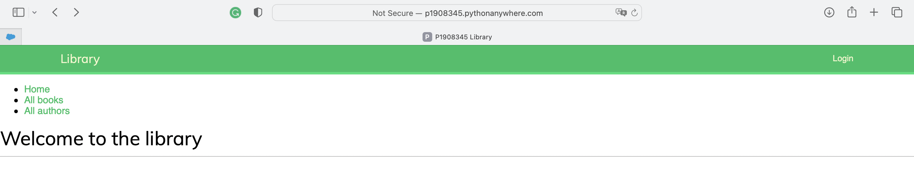

**Before Login, users can only see the book list, author list, and author detail.**

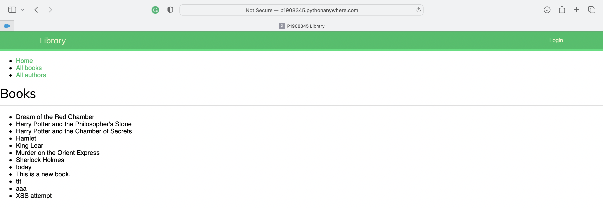

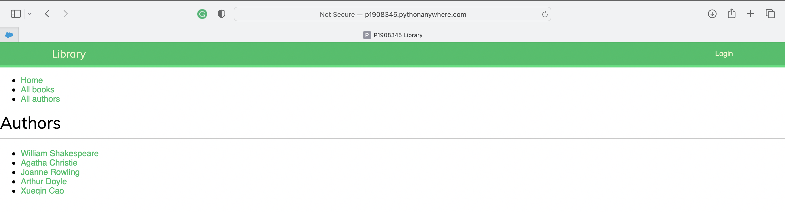

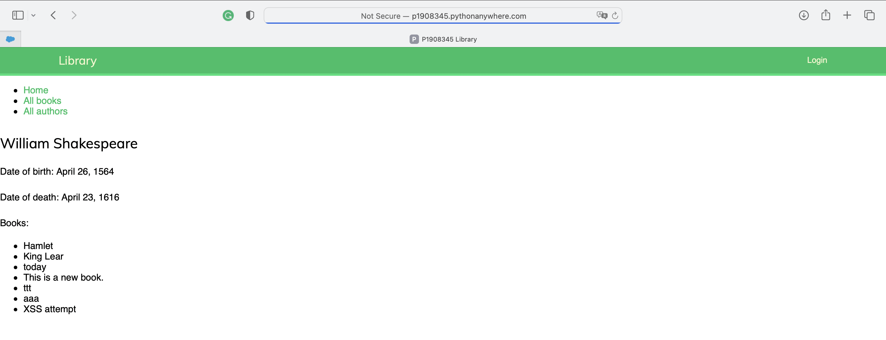

**Users can press the login button in the top right corner to log in or sign up.**

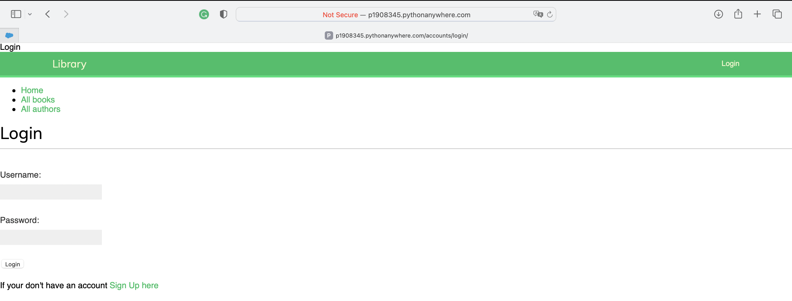

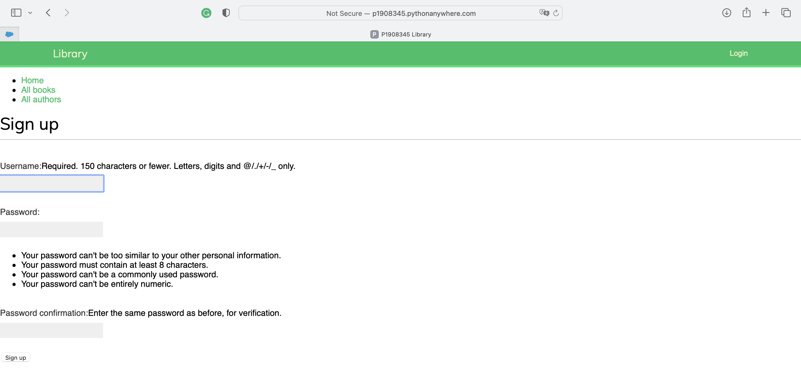

**After login, the navigation bar on the home page is changed. And users can do more actions.**

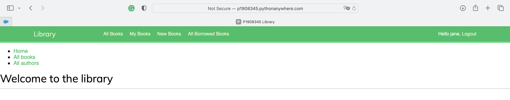

**After login, users can click the book titles in the book list and see the book details.**

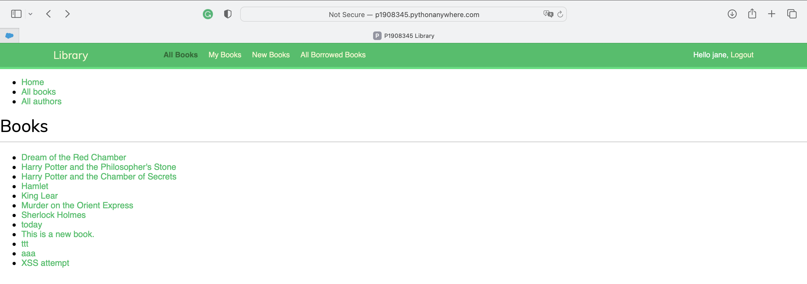

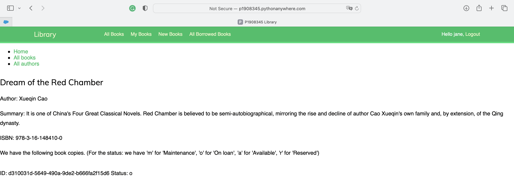

**My books:**

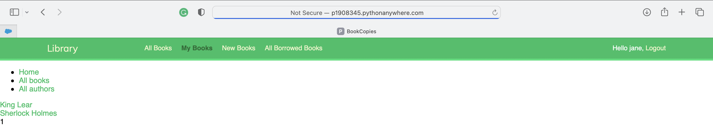

**Book details in my books:**

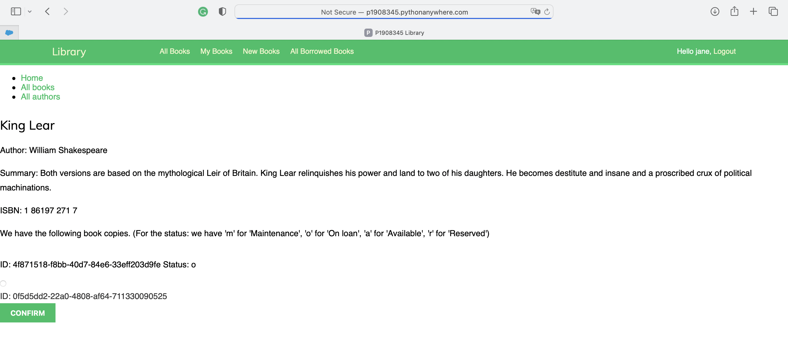

**Add new books**

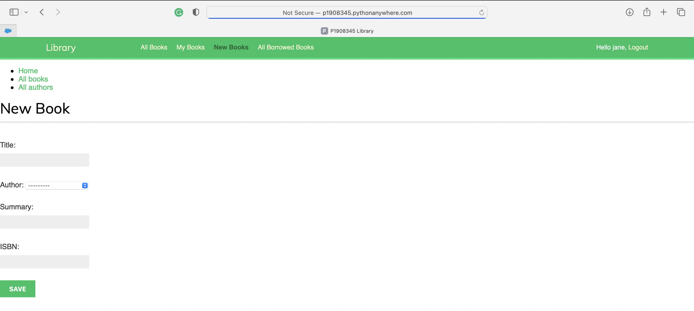

**All browsed books**

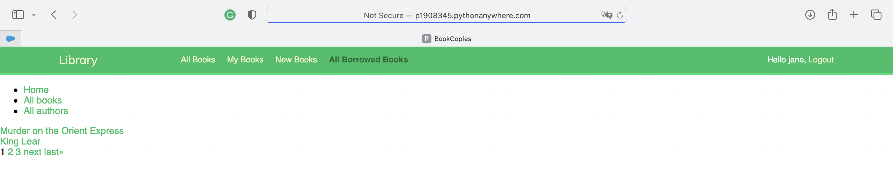
